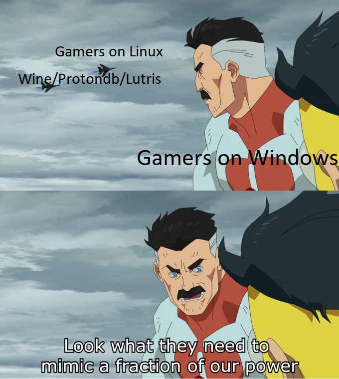
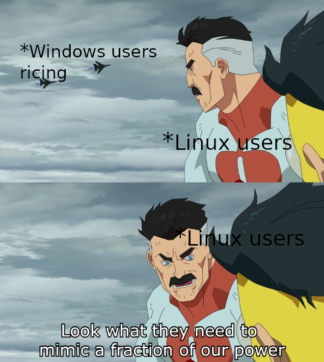
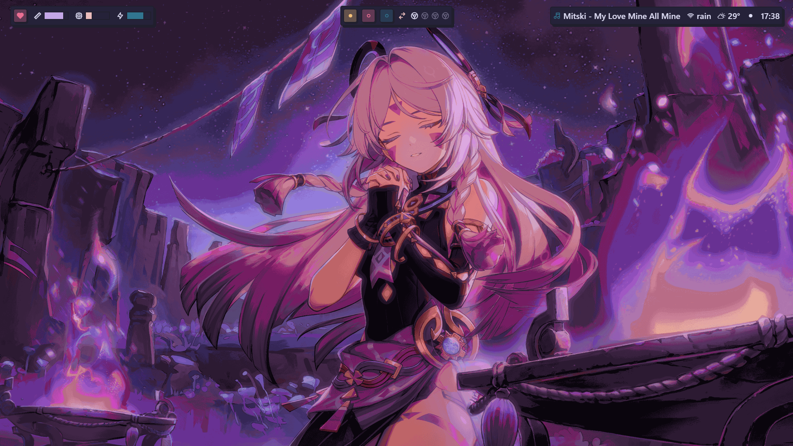
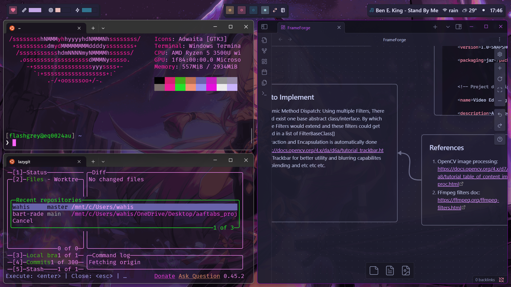
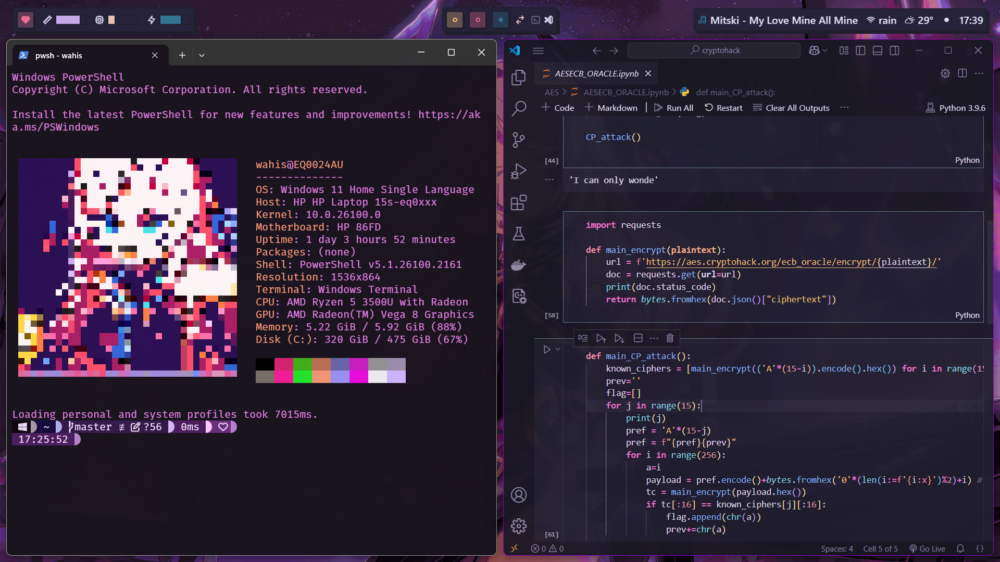

## What do you mean by a rice?

In case you don't know. A rice refers to styling and personalizing your desktop. This term and practice is more common in the linux community, because of the open source nature. It is just much more inconvenient when it comes to windows. But *you can't really stop people, can you?*

Well you can consider changing your wallpaper as ricing too, but in reality you can go ***deep.*** *really really, deep*. Its almost like an endless void. And this is my story about drowning in that void.  

You can check out [r/unixporn](https://reddit.com/r/unixporn) *This is where the rabbit hole begins.*  

## How it started

I used to scroll through r/unixporn quite a lot, and recently I had a chance to install and try out i3wm on one of my college's lap pc *(definitely not allowed)*

> i3wm: it is a tiling window manager for linux distros. Compared to the regular stacking window manager, it is highly focused on keyboard controls: reducing the mouse uses and increasing productivity.

The easy and direct access to different workspaces instantly without disturbing the my layout was a bliss! *If you like to keep multiple windows open at the same time you will understand what I am trying to say.*  

**I wanted it, really really wanted it.**

## Issues

- I have windows as my os
- I can't dual boot (I play genshin- *Not enough storage*)
- I can't switch to linux completely (I play genshin- *EAC issues*)

*even if I do switch over to linux completely I can't download the entire goddamn game again, I am limited by my data pack.*  

Looks like all my issues are due to genshin? *sigh*

Windows users rn:-  

## Things I tried

I came across many things that looked promising.

1) Windows

To my surprise, windows actually has a decent virtual desktop. Although it doesn't support tiling windows inherently, you can create layouts using [microsoft powertoys](https://learn.microsoft.com/en-us/windows/powertoys/) but the switching between desktops isn't the smoothest. There are third party softwares, that did do that job (VirtuaWin, DexPot) but they seemed old and I was skeptical of their performance, so never dived into them much.  
All in all it really does have really good potential in my eyes, I would be very happy if microsoft gives us more customizational features of such sorts, and added direct keybindings for working with virtual desktops.

2) [Seelen UI](https://github.com/eythaann/Seelen-UI)

This was one of the first things that I found, I tried it out instantly. At first I was pretty amazed, it had a tiling window manager! Good UI, good customizational options, and open source.  
But after using it for a while, I found it very laggy and there were many major bugs. But the project has some really good features upcoming. I would like to contribute to it someday, it's really well thought out.  

3) [GlazeWM](https://github.com/glzr-io/glazewm)

Glaze was just perfect for me. It was smooth, it was very much like i3 *(infact I like glaze more than i3 at this point lol)*.  
It recommends to use Zebar with it. Which acts as a taskbar alternative, which is also highly configureable.  
Although glaze and zebar take around 1 min to start themselves up *(ik its too much for some people)*. But it runs pretty smooth after that, I haven't encountered any major bugs on it yet.  

Linux users reading this:-  

## My Setup

  

OS: Windows 11
- **Status Bar:** [Neobrutal Zebar](https://github.com/adriankarlen/neobrutal-zebar/)  
- **Window Manager:** [GlazeWM (default)](https://github.com/glzr-io/glazewm)  
- **Wallpaper:** [Citlali from genshin](https://imgur.com/a/f4S0VIr) I tweaked the official wallpaper to match the purple theme  
- **Shell:** [Oh-My-Posh](https://ohmyposh.dev/)  
- **Theme:** [Velvet](https://ohmyposh.dev/docs/themes#velvet)  
- **font:** [FiraMonoNerd](https://github.com/ryanoasis/nerd-fonts/tree/master/patched-fonts/FiraMono/Regular)
- **Windows Terminal Theme:** [Sakura]  
  - You can find the colour themes [here](https://windowsterminalthemes.dev/).  
- **Obsidian:** [Catpuccin](https://publish.obsidian.md/hub/02+-+Community+Expansions/02.05+All+Community+Expansions/Themes/Catppuccin)
- **VS Code:** [Rosé Noctis](https://marketplace.visualstudio.com/items?itemName=iKenshu.rose-noctis) It's a merge between Rose pine and Catpuccin Noctis.
- **Tools:**
    - [**Microsoft Powertoys:**](https://learn.microsoft.com/en-us/windows/powertoys/) Has some actually powerful toys

# Final Thoughts

I have been enjoying my set up a lot. Haven't faced any major issues. I can work more **productively and conveniently** than ever.  

Best reactions I got to my setup was:  
> "That's windows? No way..."  
> --- *an arch user*

That's when I knew I did it well.  